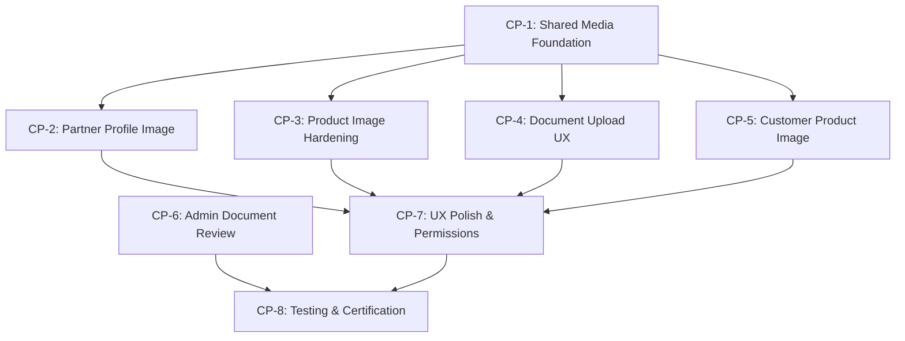

# QuickGO M1 Phase 3 — Checkpoint Dependency Graph

**Document**: Supporting document for M1_PHASE_3_IMPLEMENTATION_CONTRACT.md
**Status**: PLANNING ONLY

---

## Dependency Graph

---

## Checkpoint Details

### CP-1: Shared Media Foundation (NO BACKEND CHANGES)

**Objective**: Create reusable widgets and utilities in shared packages

**New Files**:
| File | Purpose |
|:---|:---|
| `shared_ui/lib/src/image_picker_sheet.dart` | Bottom sheet with Camera/Gallery/Cancel options |
| `shared_ui/lib/src/upload_progress_widget.dart` | Deterministic progress bar with cancel |
| `shared_ui/lib/src/cached_image.dart` | `CachedNetworkImage` wrapper with QuickGO defaults |
| `shared_ui/lib/src/avatar_widget.dart` | Circular avatar with edit overlay, tap handler |
| `shared_ui/lib/src/document_type_selector.dart` | Dropdown for document types per partner type |
| `shared_ui/lib/src/permission_handler.dart` | Camera/storage permission request + Settings redirect |

**Modified Files**:
| File | Change |
|:---|:---|
| `shared_ui/pubspec.yaml` | Add `cached_network_image`, `permission_handler` |
| `shared_api/lib/quickgo_api_client.dart` | Add `onSendProgress` callback to `uploadFile()` |

**Dependencies**:
- None (first checkpoint)

**Exit Criteria**:
- `flutter analyze` passes for shared packages
- Widget unit tests pass for image picker sheet, avatar widget

---

### CP-2: Partner Profile Image

**Objective**: Vendor and Rider can upload, replace, remove profile avatars

**Modified Files**:
| File | Change |
|:---|:---|
| `partner_app/lib/src/screens/vendor_mode_screen.dart` | Add AvatarWidget to profile tab with upload/remove actions |
| `partner_app/lib/src/screens/rider_mode_screen.dart` | Add AvatarWidget to profile tab with upload/remove actions |
| `partner_app/lib/src/providers.dart` | Add avatar refresh logic |

**API Calls**:
- `POST /api/v1/profile/avatar` (multipart, existing)
- `DELETE /api/v1/profile/avatar` (existing)

**Dependencies**: CP-1

**Exit Criteria**:
- Avatar displays after upload
- Avatar persists after app restart (reload from profile API)
- Old avatar replaced on re-upload
- Placeholder shown after removal
- Upload progress visible

---

### CP-3: Product Image Hardening

**Objective**: Harden existing product image flow with progress, retry, permission handling

**Modified Files**:
| File | Change |
|:---|:---|
| `partner_app/lib/src/screens/vendor_mode_screen.dart` | Update `_ProductFormDialog._pickImage()` to use shared picker; add progress; add retry |

**API Calls**:
- `POST /api/v1/vendor/products/:id/image` (multipart, existing)

**Dependencies**: CP-1

**Exit Criteria**:
- Camera capture works with permission
- Gallery selection works
- Upload progress visible
- Retry on failure works
- Duplicate submit prevented
- Image preview updates after upload

---

### CP-4: Document Upload UX

**Objective**: Replace free-text document dialogs with proper upload UX

**Modified Files**:
| File | Change |
|:---|:---|
| `partner_app/lib/src/screens/vendor_mode_screen.dart` | Replace compliance doc dialog with dropdown, rejection reason display, expiry display |
| `partner_app/lib/src/screens/rider_mode_screen.dart` | Replace KYC doc dialog with dropdown, rejection reason display |

**API Calls**:
- `POST /api/v1/partner/documents/upload` (multipart, existing)
- `GET /api/v1/vendor/compliance-documents` (existing — enhanced display)
- `GET /api/v1/rider/kyc-documents` (existing — enhanced display)

**Dependencies**: CP-1

**Exit Criteria**:
- Document type is dropdown, not free-text
- Rejection reason visible for rejected documents
- Expiry date visible for documents with expiry
- Upload progress visible
- Duplicate submit prevented

---

### CP-5: Customer Product Image

**Objective**: Add cached image loading to product cards and detail screen

**Modified Files**:
| File | Change |
|:---|:---|
| `customer_app/pubspec.yaml` | Add `cached_network_image` |
| `customer_app/lib/src/widgets/product_card.dart` | Replace `Image.network` with CachedImage widget |
| `customer_app/lib/src/screens/product_detail_screen.dart` | Replace `Image.network` with CachedImage widget |

**Dependencies**: CP-1

**Exit Criteria**:
- Product images load with cache
- Placeholder shown for missing images
- Error icon shown for broken URLs
- Loading shimmer/spinner during download

---

### CP-6: Minimum Admin Document Review

**Objective**: Ensure Admin Panel can review, approve, reject partner documents

**Modified Files**:
| File | Change |
|:---|:---|
| `web/admin_panel/app/page.tsx` | Add document list under vendor/rider profile; add approve/reject with reason |

**API Calls**:
- `GET /api/v1/admin/vendors/:id/compliance-documents`
- `GET /api/v1/admin/riders/:id/kyc-documents`
- `PATCH /api/v1/admin/vendor-compliance-documents/:id/review`
- `PATCH /api/v1/admin/rider-kyc-documents/:id/review`
- `GET /api/v1/admin/compliance-documents/:id/view`

**Dependencies**: None (independent of Flutter work)

**Exit Criteria**:
- Documents listed under partner profile in admin panel
- Approve button works
- Reject requires reason
- Document preview link works

---

### CP-7: UX Polish and Android Permissions

**Objective**: Camera permission declaration, keyboard safety, navigation fixes, lifecycle display

**Modified Files**:
| File | Change |
|:---|:---|
| `partner_app/android/app/src/main/AndroidManifest.xml` | Add `CAMERA` permission |
| `partner_app/lib/src/screens/vendor_mode_screen.dart` | Keyboard safety; suspended/terminated state display |
| `partner_app/lib/src/screens/rider_mode_screen.dart` | Keyboard safety; suspended/terminated state display |

**Dependencies**: CP-2, CP-3, CP-4, CP-5

**Exit Criteria**:
- No RenderFlex overflow at standard widths
- Keyboard does not hide primary actions
- Suspended partner sees restriction banner
- Terminated partner sees termination notice
- Camera permission works end-to-end

---

### CP-8: Testing and Certification

**Objective**: Run all automated tests; document manual device checks

**Verification Plan**:
1. `cd backend && npm test` — all unit tests pass
2. `cd backend && npm run test:e2e` — all E2E tests pass
3. `cd mobile/customer_app && flutter analyze` — no issues
4. `cd mobile/partner_app && flutter analyze` — no issues
5. Manual checklist (documented separately)

**Dependencies**: CP-6, CP-7

**Exit Criteria**:
- All backend tests pass (47+ unit, 17+ E2E)
- `flutter analyze` clean for both apps
- Manual test checklist completed
- No regression in existing features

---

## Parallel Execution Opportunities

| Parallel Track A | Parallel Track B |
|:---|:---|
| CP-2, CP-3, CP-4 (Partner App) | CP-5 (Customer App) |
| CP-2, CP-3, CP-4 (Partner App) | CP-6 (Admin Panel) |

CP-1 must complete before all others. CP-7 and CP-8 are sequential finalization steps.

---

## Estimated Effort

| Checkpoint | Estimated Files Changed | Complexity |
|:---|:---|:---|
| CP-1 | 8 (6 new, 2 modified) | Medium |
| CP-2 | 3 | Low-Medium |
| CP-3 | 1 | Medium |
| CP-4 | 2 | Medium |
| CP-5 | 3 | Low |
| CP-6 | 1 | Medium-High (monolith file) |
| CP-7 | 3 | Low-Medium |
| CP-8 | 0 (verification only) | Low |
| **Total** | **~21 files** | — |
