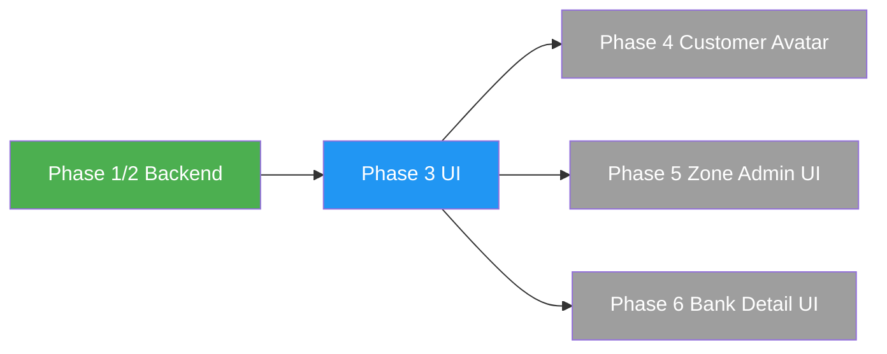

# QuickGO M1 Phase 3 — Scope Boundary and Deferred Items

**Document**: Supporting document for M1_PHASE_3_IMPLEMENTATION_CONTRACT.md
**Status**: PLANNING ONLY

---

## 1. Scope Boundary

### IN SCOPE (Phase 3)

| Item | Justification |
|:---|:---|
| Vendor profile image upload/replace/remove | Direct M1 requirement; backend API ready |
| Rider profile image upload/replace/remove | Direct M1 requirement; backend API ready |
| Product image upload/camera/gallery hardening | Existing but needs permission handling and progress |
| Customer product image display with caching | Direct M1 requirement; backend already returns `imageUrl` |
| Partner document upload UX improvement | Existing but free-text type; needs dropdown and rejection display |
| Minimum admin document review integration | Required to complete partner-admin document cycle |
| Camera permission declaration and handling | Android requirement for camera features |
| Upload progress indicator | UX requirement for large file uploads |
| Duplicate submit prevention | Data integrity requirement |
| Verification badge display | Exists partially; needs lifecycle state awareness |
| Suspended/terminated state display | Direct M1 requirement |
| Cached network images | Performance requirement |
| Document rejection reason display | Partner needs to know why doc was rejected |
| Document expiry date display | Partner needs to know expiry status |

### OUT OF SCOPE (Phase 3) — WITH CLASSIFICATION

| Item | Classification | Rationale |
|:---|:---|:---|
| Customer profile image upload | LATER MILESTONE (Phase 4+) | Not core to partner media delivery; backend ready but customer app needs design |
| Customer avatar display in app | LATER MILESTONE (Phase 4+) | Blocked on customer profile image upload |
| Multiple product images / image gallery | LATER MILESTONE | Schema supports single image only; schema change needed |
| Image cropping / rotation | LATER MILESTONE | Requires additional package (image_cropper); not MVP |
| Video upload for products | LATER MILESTONE | Schema and backend do not support video |
| Full admin panel componentization | SEPARATE MILESTONE | Admin panel is 173KB monolith; refactoring scope is large |
| Admin Panel full compliance dashboard | LATER MILESTONE | Phase 3 adds minimum review only |
| Zone admin management UI | LATER MILESTONE (Phase 5) | Backend ready; full UI requires separate design |
| Service zone creation UI | LATER MILESTONE (Phase 5) | Backend ready; full UI requires separate design |
| Partner bank detail submission UI | PRODUCT DECISION REQUIRED | Backend ready; needs business rule clarification |
| Bank detail history viewer | LATER MILESTONE | Backend ready; UI not designed |
| Real SMS/OTP provider (MSG91) | INFRASTRUCTURE | Not a feature; configuration at deploy time |
| Real push notification delivery (FCM) | INFRASTRUCTURE | Not a feature; configuration at deploy time |
| Production Cloudinary configuration | INFRASTRUCTURE | Not a feature; configuration at deploy time |
| iOS build and release | OUT OF SCOPE | No iOS configuration exists in project |
| Hindi/regional language localization | LATER MILESTONE | Phase 3 adds localization-ready structure only |
| Offline mode / queue | LATER MILESTONE | Complex; not MVP |
| Image watermarking | LATER MILESTONE | Not required for MVP |
| Document OCR / auto-fill | LATER MILESTONE | Requires third-party service |
| Compliance audit calendar | LATER MILESTONE | UI for scheduled audits not designed |
| Multi-zone vendor support | LATER MILESTONE | Schema change required |
| Vendor store logo (separate from avatar) | LATER MILESTONE | Schema change required |
| Delivery proof image upload (rider) | EXISTS IN BACKEND | Not part of Phase 3 scope |
| Malware/virus scanning | DEFERRED INFRASTRUCTURE | Hook exists in storage pipeline |

---

## 2. Scope Change Control

Any request to add items from the "OUT OF SCOPE" list into Phase 3 must:

1. Be approved by the user explicitly
2. Include impact assessment on Phase 3 timeline
3. Update the implementation contract
4. Update the risk register
5. Update the checkpoint dependency graph

---

## 3. Minimum Viable Phase 3

If further scope reduction is needed, the absolute minimum Phase 3 is:

| Priority | Item |
|:---|:---|
| P0 | Vendor profile image (CP-2) |
| P0 | Rider profile image (CP-2) |
| P0 | Camera permission handling (CP-7) |
| P0 | Customer product image caching (CP-5) |
| P1 | Document type dropdown (CP-4) |
| P1 | Document rejection reason display (CP-4) |
| P1 | Upload progress indicator (CP-1) |
| P2 | Admin document review (CP-6) |
| P2 | Suspended/terminated state display (CP-7) |
| P2 | Upload retry (CP-3) |

P0 items deliver the core "partner media" promise.
P1 items deliver the core "compliance UX" promise.
P2 items can be deferred to a Phase 3.1 if needed.

---

## 4. Inter-Milestone Dependencies

Phase 3 has NO upstream blockers — Phase 1/2 backend is fully implemented.
Phase 3 UNBLOCKS future milestones 4, 5, and 6.
